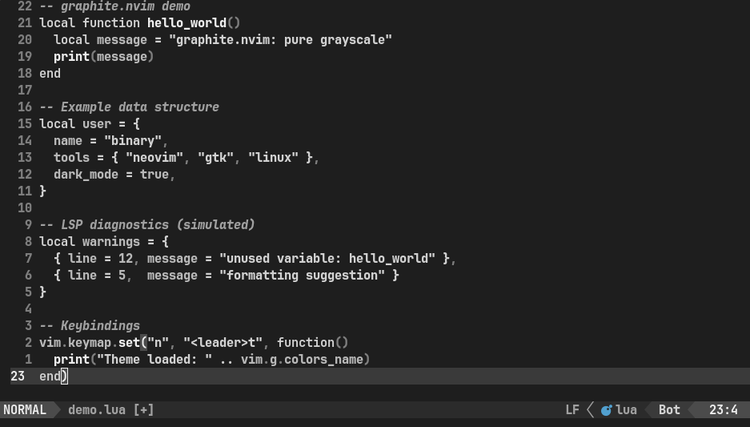

# graphite.nvim

A pure grayscale theme for Neovim, designed for eye comfort in low-light environments.  
No colors, no distractions—just clean typography.  

 

### Why?
- **Easier on the eyes** at night (especially in dark rooms)  
- **Matches Graphite GTK** for system-wide aesthetic harmony 
- **Reduces visual fatigue** from colorful syntax highlighting  

### Install (lazy.nvim)
```lua
{
  "binarylinuxx/graphite-nvim",
  priority = 1000,  -- Load first
  config = function()
    vim.cmd.colorscheme("graphite")
  end,
}

### TO-DO
- other color varitiones from original graphite GTK theme []
